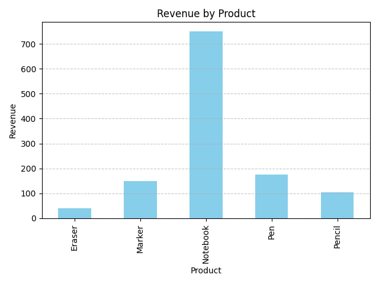

<!-- ===================== ARCHIVED NOTICE ===================== -->

# ⚠️ ARCHIVED REPOSITORY

> 
>
> **This repository is archived and no longer actively maintained.**  
>
> The work originally contained here has been **migrated, refactored, and
> enhanced** as part of a **unified, industry-aligned Data Analyst Internship
> repository**.
>
> <p align="left">
>   <a href="https://github.com/atharmshaikh/data-analyst-internship-tasks/tree/main/Task-07_Basic-Sales-Summary-SQLite-Python">
>     
>   </a>
> </p>
>
> ### ➡️ Active, maintained version
>
> https://github.com/atharmshaikh/data-analyst-internship-tasks/tree/main/Task-07_Basic-Sales-Summary-SQLite-Python
>
> ---
>
> ### Why this repository was archived
>
> - This repository represented an **early, standalone implementation**
> - The task has since been **restructured to industry standards**
> - Documentation, folder structure, and version control practices were improved
> - All future updates will occur **only in the unified internship repository**
>
> This archived repository is preserved **for historical reference only**.

<!-- =========================================================== -->

# 🧾 Task 7: Basic Sales Summary using SQLite & Python

## 📌 Objective
This project demonstrates how to extract basic sales insights from a simple SQLite database using Python. It uses SQL queries to pull product-level sales data, summarizes the results, and visualizes the revenue using a bar chart.

---

## 🛠 Tools & Technologies Used
- **Python 3.x**
- **SQLite3** (built-in Python module)
- **Pandas** (for data manipulation)
- **Matplotlib** (for basic data visualization)
- **Jupyter Notebook** (for development & presentation)

---

## 📁 Dataset
A tiny SQLite database named `sales_data.db` containing a single `sales` table with sample fields:

- `product` (text)  
- `quantity` (integer)  
- `price` (float)

---

## 📊 SQL Summary Performed

```sql
SELECT 
    product, 
    SUM(quantity) AS total_qty, 
    SUM(quantity * price) AS revenue
FROM sales
GROUP BY product;
````

This query helps us understand:

* Total units sold per product
* Total revenue generated per product

---

## 📈 Output

* **Console Output**: Tabular summary of total quantity & revenue per product
* **Bar Chart**: Visual representation of revenue by product
* **Saved Chart**: `sales_chart.png` file (optional)

---

## 📂 Project Structure

`````plain text
📁 sales_summary/
├── sales_data.db             # SQLite database with sample sales
├── sales_summary.ipynb       # Jupyter Notebook with code
├── sales_chart.png           # Bar chart image (auto-saved)
└── README.md                 # This file
`````

---

## 🚀 How to Run

1. Make sure you have Python and Jupyter installed
2. Install required libraries (if not already):

```bash
   pip install pandas matplotlib
```

3. Open `sales_summary.ipynb` and run all cells
4. View the chart and printed results

---

## 📌 Key Learnings

* How to use **SQL inside Python** with SQLite
* Loading SQL query results into Pandas DataFrame
* Performing data aggregation & visualization
* Creating your first **sales dashboard** with just code

---

## 🔍 Sample Output (Console)

```
   product  total_qty  revenue
0   Eraser         20     40.0
1   Marker         15    150.0
2  Notebook         15    750.0
3      Pen         35    175.0
4   Pencil         35    105.0
```

---

## ✨ Visualization




